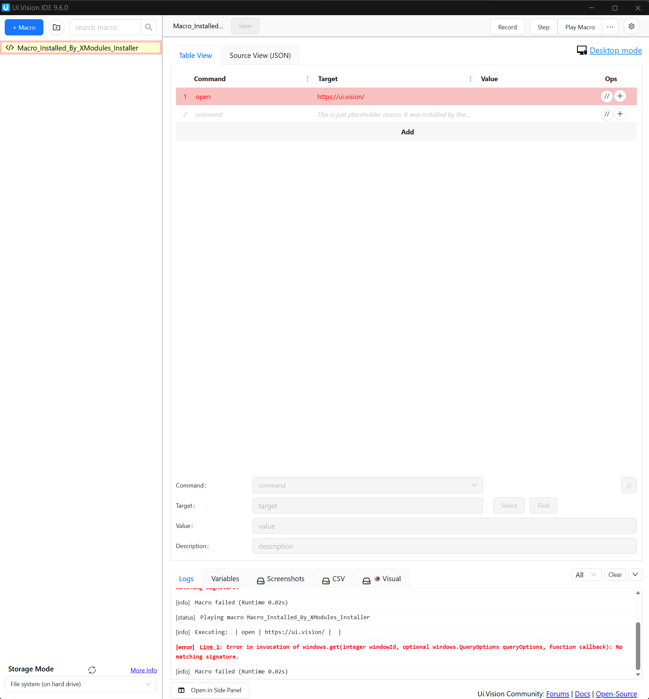
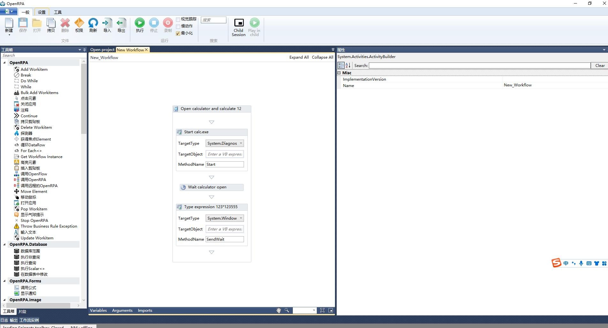
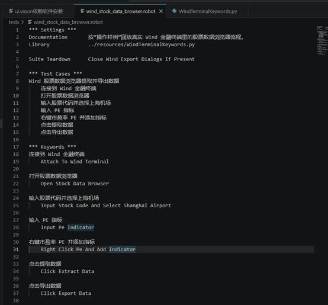
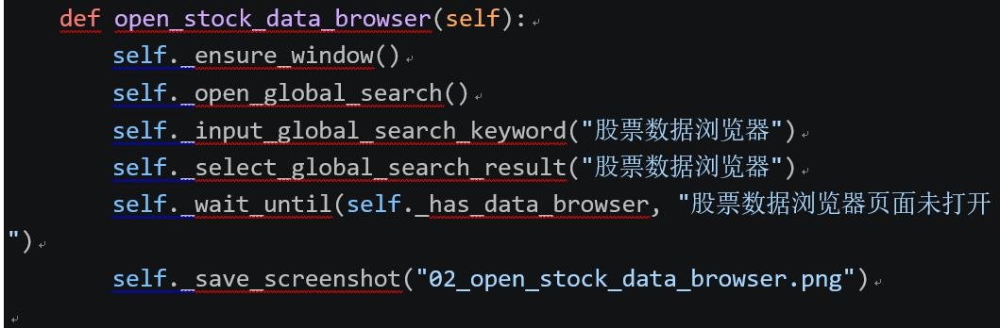
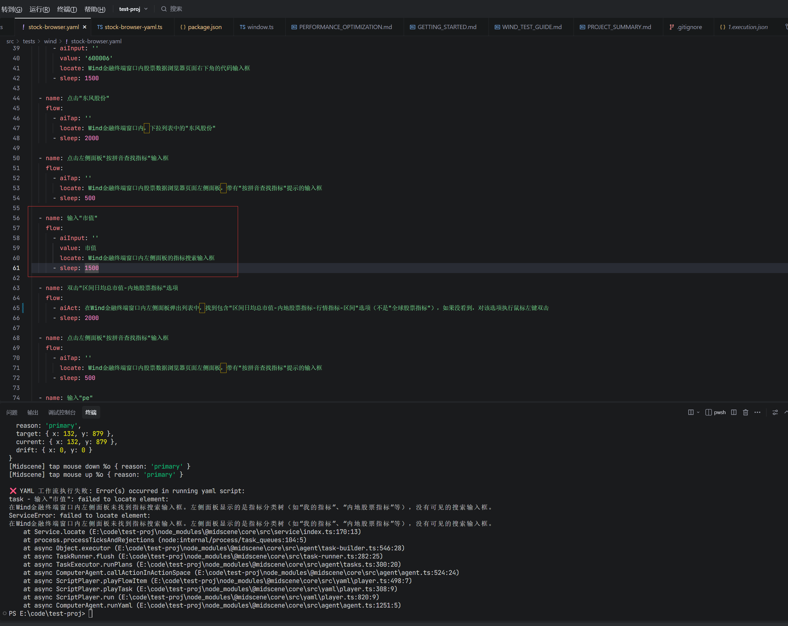

# 框架测试过程文档

## 测试目标

本轮横向测试围绕“录制/示教 -> 固化流程 -> 参数化 -> 稳定回放”这一目标，重点验证各框架在 Windows 桌面软件，尤其是 Wind 这类金融终端场景下的可用性。

重点关注：

- 是否能直接驱动 Windows 桌面软件。
- 是否支持录制或示教，并沉淀为可复用流程。
- 是否能生成稳定、可参数化、可维护的脚本。
- 对 Wind 金融终端中自绘控件、非标准控件、动态页面的适应能力。
- 是否依赖外部大模型、浏览器插件或商业服务。

---

## 1. UI.Vision RPA

### 测试过程

UI.Vision RPA 需要通过浏览器插件打开 IDE。测试时进入 UI.Vision IDE 后，可以看到宏列表、命令表格、`Record`、`Step`、`Play Macro` 等录制和回放入口。

### 测试现象

- UI.Vision 的录制和宏编辑能力比较直观，上手门槛低。
- AIChat 功能更像是辅助用户设计宏、解释命令或生成宏片段，不是由 AI 直接自主驱动桌面软件完成探索。
- AI 能力依赖国外模型或外部服务，私有化和合规性需要额外评估。
- 对桌面软件的控制更多依赖 XModules、图像/OCR、坐标或桌面模式能力，稳定性受界面状态影响。

### 阶段结论

UI.Vision RPA 更适合作为低门槛宏录制和视觉自动化工具。它具备录制、回放和参数化基础能力，但 AI 并不能直接替代人工完成桌面软件探索和流程固化。

---

## 2. OpenRPA

### 测试过程

OpenRPA 本身是传统 RPA 软件，提供工作流设计器、录制器、活动组件和流程执行能力。测试中使用 OpenRPA 设计器创建示例流程，可以通过活动节点编排启动程序、等待窗口、输入文本等步骤。

### 测试现象

- OpenRPA 的流程设计方式接近传统 RPA Studio，适合明确步骤的自动化流程。
- 可以通过工作流方式组织操作，但 AI 无法直接驱动录制或根据自然语言自动探索。
- 对 Wind 这类金融终端，如果控件可识别，可以尝试用传统 UI 自动化方式处理；如果控件是自绘或复杂表格，仍可能需要图像识别、脚本或人工配置兜底。
- 录制结果要稳定参数化，仍需要人工整理变量、等待条件、异常处理和重试逻辑。

### 阶段结论

OpenRPA 适合作为传统 RPA 流程固化工具，但不满足“AI 自主探索并自动生成稳定参数化脚本”的完整目标。

---

## 3. Robot Framework + RPA Framework

### 测试过程

该方案通过 Robot Framework 编写 `.robot` 测试/自动化脚本，再调用 Python 关键字库完成具体桌面操作。测试中尝试用自然语义化的 Robot 脚本描述 Wind 金融终端流程，例如打开股票数据浏览器、输入股票代码、添加指标、导出数据等。

对于 Wind 这类金融终端，很多控件是自绘控件，Robot Framework / RPA.Windows 默认关键字未必能稳定识别，因此核心操作通常需要下沉到 Python 自定义关键字中实现。

### 测试现象

- Robot 脚本可读性较好，适合把业务流程写成接近自然语言的步骤。
- 参数化、日志、报告、批量执行、失败定位能力较强。
- 但 Wind 客户端中的大量控件无法仅靠通用 RPA.Windows 关键字稳定处理。
- 实际落地时，Robot 更像流程编排层；具体点击、输入、窗口识别、等待和截图校验需要 Python、pywinauto、OCR、图像识别等能力补齐。

### 阶段结论

Robot Framework + RPA Framework 适合作为生产化回放、日志和报告层，但不是开箱即用的桌面录制回放方案。面对 Wind 这类复杂客户端时，需要大量自定义 Python 逻辑。

---

## 4. Microsoft UFO / UFO²

### 测试过程

Microsoft UFO / UFO² 属于 Windows GUI Agent 框架，核心思路是外接大模型，通过截图、控件信息和任务规划来操作 Windows 应用。

### 测试现象

- 需要配置外部大模型，部署和调试成本较高。
- 参数化脚本和稳定回放体系不成熟。
- 本质上更接近 Agent 框架，而不是传统录制器或脚本生成器。
- 对 Wind 这类金融终端是否能稳定识别控件、规划路径和恢复异常，需要单独做更完整的 PoC。

### 阶段结论

UFO 适合验证“AI 自主探索 Windows 应用”的方向，但不适合作为当前生产化录制回放的主执行层。

---

## 5. Midscene

### 测试过程

Midscene 通过 YAML/JS 工作流描述操作目标，并由 AI 根据界面截图理解和定位元素。测试中尝试按流程操作 Wind 金融终端内的股票数据浏览器，例如输入股票代码、点击股票、查找指标、输入指标名称等。

### 测试现象

- Midscene 可以用较自然的描述来定位界面元素，脚本可读性较好。
- 对标准控件或清晰 UI 元素，具备一定自动定位能力。
- 在 Wind 金融终端的非标准控件、自绘面板、复杂侧栏中，定位存在不稳定情况。
- 例如点击指标搜索框后，下一步应输入搜索关键词，但实际执行中可能提示找不到输入框。
- 该问题并非每次必现，说明模型定位和界面状态之间存在不确定性。

### 阶段结论

Midscene 是 AI 探索和语义化工作流方向中比较接近目标的方案，但在 Wind 这类复杂桌面客户端上仍存在不稳定性。它适合作为探索层或辅助生成流程，不建议单独承担高频批量生产回放。

---

## 6. OpenAdapt

### 测试过程

OpenAdapt 的目标是通过示范录制形成 AI 可学习的数据，让模型学习用户在当前屏幕上的任务执行方式，再尝试动态执行。

### 测试现象

- 核心范式是“人工演示 -> 记录示范 -> AI 学习和回放”。
- 更接近示教学习，而不是传统脚本录制器。
- 当前仍属于 alpha 软件，文档、成熟度、稳定性和工程化能力都需要谨慎评估。
- 不能直接产出稳定、可审阅、可参数化的生产脚本。

### 阶段结论

OpenAdapt 适合做桌面 AI 示教回放 PoC，但不适合作为关键生产流程的单一执行方案。

---

## 7. AutoHotkey + Pulover's Macro Creator

### 测试过程

AutoHotkey + Pulover's Macro Creator 组合主要用于 Windows 桌面宏录制和脚本化。Pulover's Macro Creator 最新版本 5.4.1 主要支持 AutoHotkey v1。

### 测试现象

- 能录制键盘、鼠标和窗口操作，并导出 AHK 脚本。
- 对界面稳定性要求较高，窗口大小、窗口位置、分辨率、缩放比例变化都会影响回放稳定性。
- 录制脚本容易偏坐标化，后续需要人工优化为窗口、控件、图像或相对定位。
- 缺少内置 AI 探索、参数抽取、任务日志和生产级调度能力。

### 阶段结论

该组合适合轻量固定流程和个人办公自动化。对于 Wind 金融终端，可以作为少量键鼠动作或快捷键操作的兜底层，但不适合作为主方案。

---

## 横向测试结论

| 框架 | 录制/示教能力 | AI 探索能力 | 参数化/回放 | Wind 复杂客户端适配 | 综合判断 |
| --- | --- | --- | --- | --- | --- |
| UI.Vision RPA | 较强 | 弱，AIChat 偏辅助 | 中 | 依赖视觉/OCR/桌面模式 | 适合快速宏原型 |
| OpenRPA | 较强 | 弱 | 中 | 需看控件可识别程度 | 适合传统 RPA 流程 |
| Robot Framework + RPA Framework | 弱录制，强编排 | 可扩展 | 强 | 需要 Python 自定义逻辑 | 适合生产回放层 |
| Microsoft UFO / UFO² | 非录制型 | 强 | 弱 | 需 PoC 验证 | 适合 AI 探索验证 |
| Midscene | 脚本化工作流 | 较强 | 中 | 非标准控件不稳定 | 适合探索层，不宜单独生产 |
| OpenAdapt | 示教录制 | 中 | 弱 | 成熟度不足 | 适合研究型 PoC |
| AutoHotkey + Pulover's Macro Creator | 宏录制较强 | 无 | 中 | 依赖界面稳定 | 适合轻量兜底 |

## 初步建议

当前没有单一框架能完整满足“AI 自主探索 Wind -> 自动固化稳定参数化脚本 -> 批量无人值守回放”的目标。更稳妥的组合方式是：

1. 用 Midscene、UFO、OpenAdapt 等验证 AI 探索和路径发现能力。
2. 用 Robot Framework 作为生产化流程编排、参数化、日志和报告层。
3. 用 Python、pywinauto、OCR、图像识别实现具体 Wind 客户端操作。
4. 用 AutoHotkey 或 UI.Vision 作为少量固定键鼠动作、视觉/OCR 场景的兜底工具。
